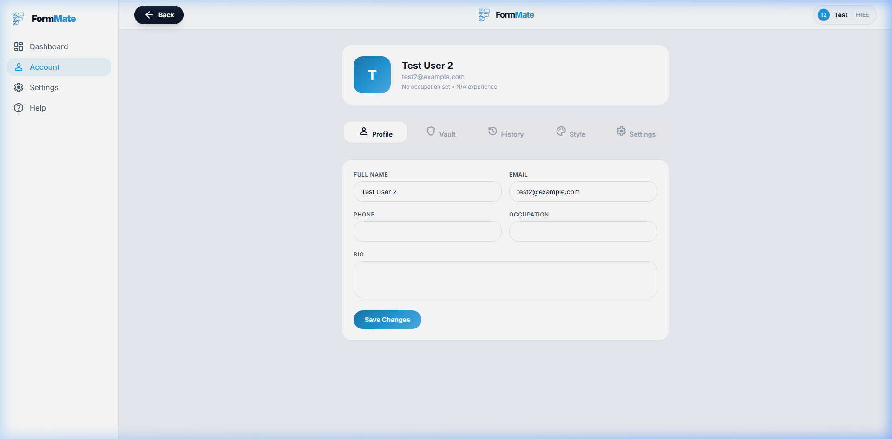

# Accounts Center Specification

## Overview
The Accounts screen (`/accounts`) functions as the central hub for the user's data payload (the "Vault") and their system settings. It uses a horizontal layout with a left sidebar for tab switching and a main right panel for content.

## Screenshots

### Default View (Profile)

*(Note: See `01_Pages/modal/modal_spec.md` for older component states of these tabs.)*

---

## Layout Breakdown

### 1. Left Sidebar Navigation
- **Branding**: Contains logo/home link.
- **Nav Items**: `Profile`, `Vault`, `History`, `Style`, `Settings`.
- **States**: Active tab highlighted using `bg-primary/10 text-primary font-bold`.

### 2. Main Content Area (`flex-1 bg-white`)
- Scrollable column rendering dynamic content based on the active tab state.
- **Top Bar**: Minimal container showing standard "Back" button.

### 3. Tab Contents
- **Profile**: Avatar generation, first name, last name, default email logic.
- **Vault**: The most complex tab. Handles CRUD operations for key-value pair memories. Includes empty states with illustration boxes.
- **History**: Chronological list of past generated forms, each linking back to its respective `workspace` state.
- **Style**: Selectors for "Default AI Tone" (Professional, Concise, Friendly, Creative) mapping to the Copilot.
- **Settings**: Slider for AI Temperature (Creative vs Precise logic mapping), UI density toggles, and Subscription status.

---

## Interaction Mapping

| Element | Interaction | Result |
|---------|-------------|--------|
| Tab Node | Click | Swaps the rendered component in the main view without affecting routing state (`?tab=` parameter in advanced routers) |
| Logout Button | Click | Fires the "Logout Confirmation" modal (`modal_spec.md`) |
| Save Changes | Click | Dispatches `setState()` and triggers a global green `Toast` notification (Save Successful) |
