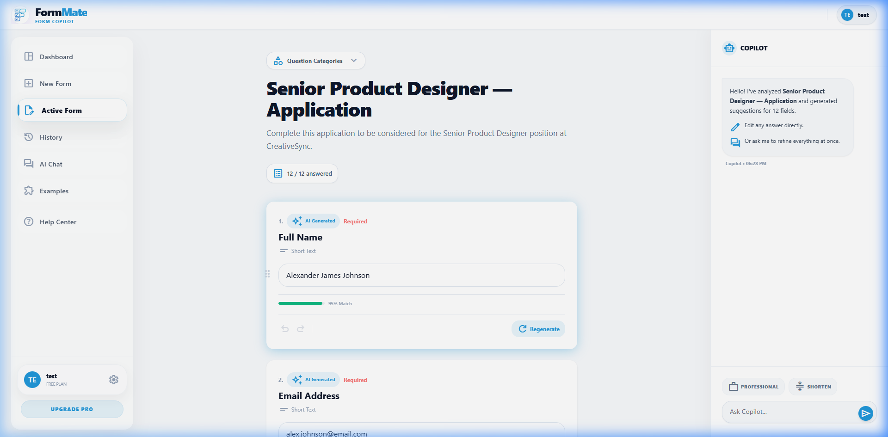

# Analyzing Pipeline Specification

## Overview
The Analyzing screen (`/analyzing`) serves as an intelligent loading interstitial. It maps parsing, thinking, and drafting events into a digestible user interface, reducing perceived load times for complex LLM operations.

## Screenshots

### Pipeline Active

---

## Layout Breakdown

### 1. Minimal Header
- FormMate branding only. No navigation options (user is "locked" in the flow until completion or error).

### 2. Main Container
- **Animation**: Whole screen enters via `animate-screen-enter`.
- **Central Box**: Floating card (`max-w-md w-full`) with a soft glass effect.
- **Top Elements**: Document processing icon (`description`) wrapped in animated rings/pulses.

### 3. Steps Pipeline
- **Component reference**: `Progress Stepper`
- **Steps**:
  1. `Scanning Document` (Parsing DOM)
  2. `Analyzing Context` (Cross-referencing Vault)
  3. `Drafting Answers` (Pinging Gemini)
- **State Logic**: 
  - `done`: Checkmark, colored green text.
  - `active`: Primary text, continuous spin animation on icon.
  - `pending`: Slate text/border icon.

---

## Modals & Error States

### Required Field Capture Modal
- **Trigger**: Occurs if the form contains a critical logic branch that the AI cannot guess (e.g., "Do you want package A or B?").
- **UI**: Standard modal layout blocking the pipeline.
- **Action**: User inputs the missing data, pipeline resumes.

### Failure/Timeout Modal
- **Trigger**: Dead links, CAPTCHA blocks, or API timeouts.
- **UI**: Modal with red visual cues (`bg-red-50` icon).
- **Actions**: "Try Again" or return to "Examples".

---

## Interaction Mapping

| State Event | UI Update |
|-------------|-----------|
| `STATE_PARSING` | Step 1 active spin, Step 2/3 pending |
| `STATE_THINKING`| Step 1 complete, Step 2 active spin, Step 3 pending |
| `STATE_DRAFTING`| Steps 1&2 complete, Step 3 active spin |
| `COMPLETE` | Triggers timeout padding, then Router to `/workspace` |
