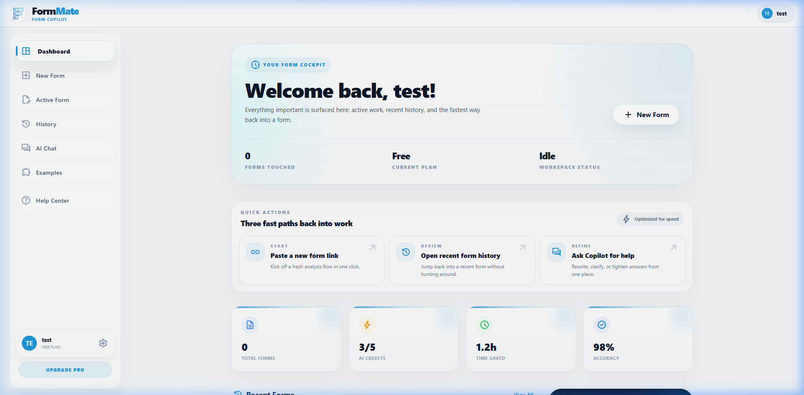

# Dashboard Specification

## Overview
The Dashboard (`/dashboard`) is the authenticated user's landing page. It provides immediate value through quick actions, consumption metrics, and a list of recently analyzed forms.

## Screenshots

### Default View

---

## Layout Breakdown

### 1. Header (`layout.js`)
- Standard authenticated header wrapper.
- Contains dynamic user tier badge (`Pro` vs `Free`).
- Profile dropdown triggering the accounts menu.

### 2. Welcome Hero
- **Content**: Greeting ("Welcome back, [First Name]") + primary call to action.
- **Action**: "New Form" button (`.btn-press`, primary color) redirects to `/new`.
- **Secondary**: "Watch Tutorial" ghost button.

### 3. Quick Actions
- **Container**: `grid grid-cols-1 md:grid-cols-3 gap-4`.
- **Items**: 
  - `New Form` (Icon: add, Primary gradient text)
  - `Browse Templates` (Icon: explore, Emerald text)
  - `Open Vault` (Icon: lock, Blue text)
- **Component reference**: `Quick Action Card`.

### 4. Metrics Grid
- **Container**: `grid grid-cols-2 lg:grid-cols-4 gap-4`.
- **Items**:
  - `Forms Today` (count)
  - `Forms Total` (count)
  - `Time Saved` (estimated hours)
  - `Accuracy` (%)
- **Component reference**: `Stat Card`.

### 5. Main Content Split
- **Left Column (2/3 width)**:
  - "Recent Forms" list. Each row is a clickable card linking to history.
  - State: Empty state shows a placeholder with a prompt to "Analyze your first form".
- **Right Column (1/3 width)**:
  - **Quick Tip**: Slate-50 box with a lightbulb icon introducing a feature block (e.g., Vault setup).
  - **Pro Card**: Gradient banner prompting upgrade (hidden if already Pro).

---

## Interaction Mapping

| Element | Interaction | Result |
|---------|-------------|--------|
| `New Form` Action | Click | Directs to `http://localhost:5173/new` |
| `Open Vault` Action | Click | Directs to `http://localhost:5173/accounts` (Vault tab focus) |
| Recent Form Row | Hover | Background shifts to `hover:bg-slate-50`, shadow slightly deepens |
| Recent Form Row | Click | Restores state from `localStorage` and transitions to `/workspace` |
