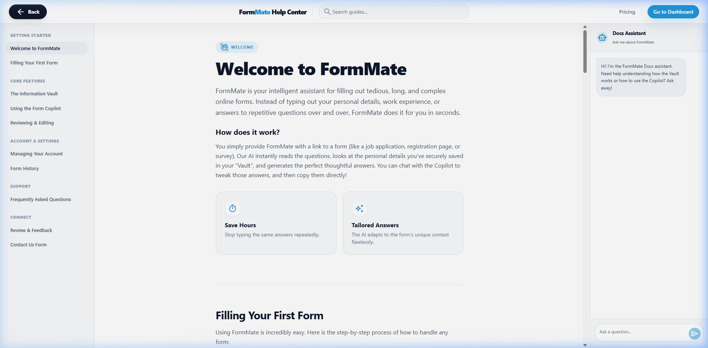

# Docs & Contact Specification

## Overview
The Docs screen (`/docs`) functions as an interactive user manual. It leverages a three-panel split (Nav Sidebar, Content, AI Bot Sidebar) to drastically simplify the onboarding process for complex platform concepts.

## Screenshots

### Documentation Center

---

## Layout Breakdown

### 1. Global Header Split
- Topbar navigation deviates from the standard logged-in app. Shows `FormMate Help Center` text and a global Search Input in the center.

### 2. Left Anchor (Navigation Sidebar)
- Hidden on mobile (`hidden md:flex`).
- Displays 5 categories: Getting Started, Core Features, Account & Settings, Support, Connect.
- Active states are tracked via Intersection Observer scrolling (`.bg-slate-200/50`).
- Contains a resizer handle (`#handle-left`).

### 3. Center Anchor (Content)
- Standard markdown-style article rendering. Contains the "Welcome", "First Form", "Vault", "Copilot" tutorials.
- Included interactive elements:
  - **Star Rating Element**: 5 hoverable material stars tracking feedback state (1-5).
  - Feedback/Contact form textareas.

### 4. Right Anchor (Docs AI Copilot)
- Hidden on small screens (`hidden lg:flex`).
- Specialized widget mimicking the Workspace Copilot but restricted strictly to answering FormMate operational queries (`system` persona).
- Input height dynamically expands via JS text measurement.

---

## Interaction Mapping

| Element | Interaction | Result |
|---------|-------------|--------|
| Search Bar | Input (Type) | Opens `#search-results-dropdown` filtering client-side static JSON index of docs topics. |
| Resize Handle | Drag | Adjusts widths of `sidebarLeft` and `sidebarRight` via tracking `clientX` |
| Feedback Submit | Click | Triggers a green toast and clears the form payload |
| Contact Submit | Click | Triggers a green toast and clears the form payload |
