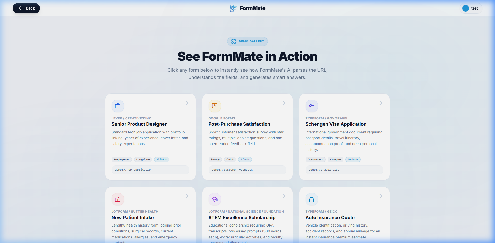

# Examples (Showcase)

## Overview
The Examples page (`/examples`) operates as a marketing catalog and demonstration utility. It provides users a grid of predefined complex forms that simulate the AI extraction process without requiring a custom URL.

## Screenshots

---

## Layout Breakdown

### 1. Header & Hero
- **Badge**: `Demo Gallery` primary-tinted pill.
- **Hero Text**: "See FormMate in Action".
- **Container**: Standard max-width container `max-w-6xl mx-auto`.

### 2. Demo Grid
- **Container**: `grid grid-cols-1 md:grid-cols-2 lg:grid-cols-3 gap-6`.
- **Card Elements (`Demo Card` base component)**:
  - Top Left: Theme-colored Material Icon (e.g., green `volunteer_activism` for Grants).
  - Title & Company.
  - Description paragraph (`text-slate-500 text-sm`).
  - Metadata Tags: e.g., `[Medical] [Sensitive] [50+ fields]`.

### 3. Animation Sequences
- The grid staggering uses `stagger-children` utility class on entry.
- Hovering a card performs a dual-animation:
  - Icon block scales `group-hover:scale-110`.
  - Arrow icon translates on X-axis `group-hover:translate-x-1`.

---

## Interaction Mapping

| Element | Interaction | Result |
|---------|-------------|--------|
| Background | View | Contains subtle, static `bg-mesh` class |
| Demo Card | Click | Forces state update `setState({ formUrl: card.dataset.url })` and instantly routes to `/analyzing` |
| Demo Card | Focus | Keyboard accessibility supported; `tabindex="0"` allows Enter/Space to trigger analysis |
