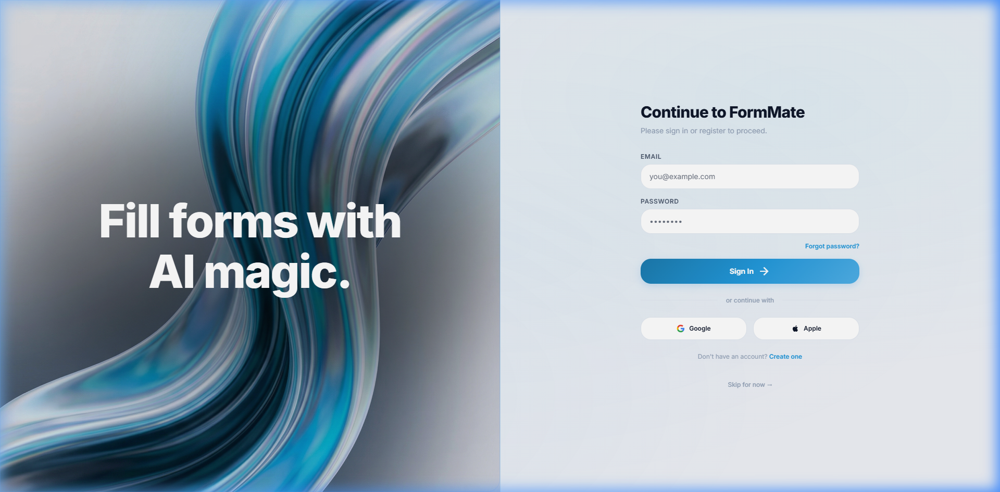
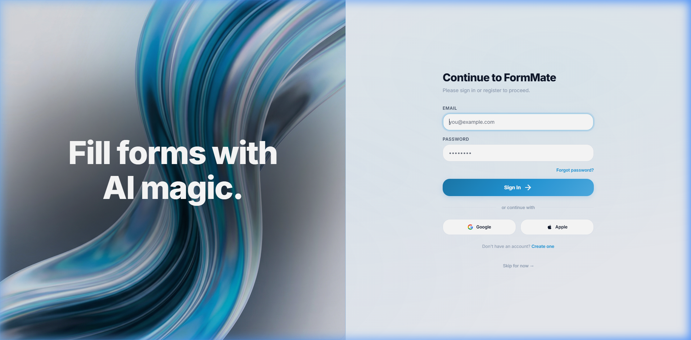
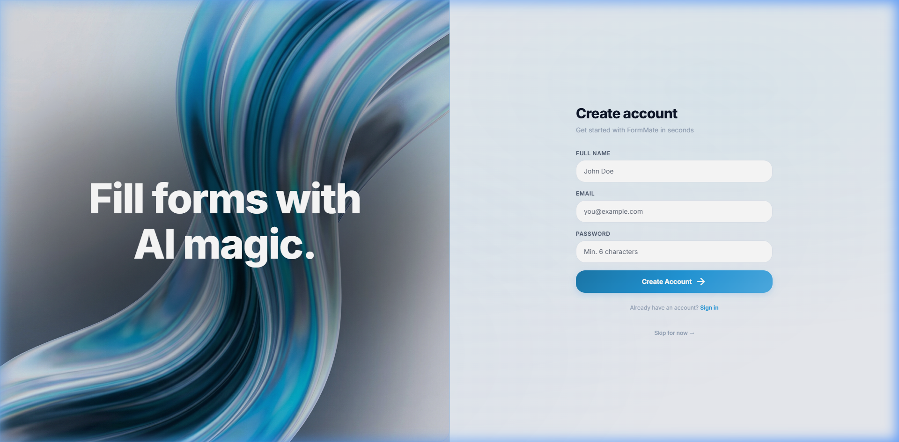
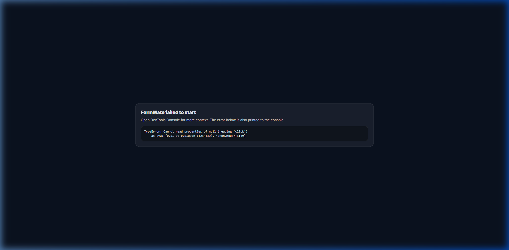

# Auth Page (Form-Heavy) — UI Specification

> **Route**: `/auth` · **Title**: `Sign In | FormMate` · **File**: `src/screens/auth.js`

---

## Overview

The auth page contains **three switchable forms** (Login, Signup, Forgot Password) — making it the most form-heavy page in the app. It uses a split-panel layout: a decorative brand panel on the left (desktop only) and the form on the right.

---

## Screenshots

### Login Form (Default)

### Focused Input State

### Signup Form

### Forgot Password Form

---

## Layout Breakdown (Left → Right)

### Panel A: Left Decorative Panel (Desktop Only)

- **Position**: Left half, `lg:w-1/2`, `hidden lg:flex`
- **Background layers** (bottom to top):
  1. Solid dark base: `bg-[#0d1017]`
  2. Background image: `background-image: url('/login-bg.png')`, `opacity-90`, covers full panel
  3. Inward stroke effect: `shadow-[inset_0_0_0_1px_rgba(91,155,255,0.2)]`
  4. Dark blur cloud: `w-[110%] h-[50%] bg-black/40 blur-[80px] rounded-full` centered for contrast
  5. Text overlay: `z-20`
- **Text**: "Fill forms with AI magic."
  - `text-white text-6xl xl:text-[5.5rem] font-extrabold leading-[1.1] tracking-tight text-center`
- **Ring**: `ring-1 ring-primary/20` on the panel itself

### Panel B: Right Form Panel

- **Position**: Right side `flex-1`, vertically and horizontally centered
- **Container**: `max-w-[420px]`, `px-6 py-12`

---

## Form 1: Login (Default Visible)

| Element | Exact Text | Position | Size | Spacing | Alignment | Visual |
|---------|------------|----------|------|---------|-----------|--------|
| Mobile Logo | Logo + "Form**Mate**" | Top-left, `lg:hidden` | Logo `size-10`, text `text-xl` | `mb-10`, `gap-3` | Left | `font-black tracking-tighter` |
| Heading | "Continue to FormMate" | Top of form | `text-3xl` | `mb-2` | Left | `font-extrabold tracking-tight`, color `var(--fm-text)` |
| Subheading | "Please sign in or register to proceed." | Below heading | `text-sm` | `mb-8` | Left | color `var(--fm-text-tertiary)` |
| Email Label | "EMAIL" | Above email input | `text-xs` | `mb-1.5` | Left | `font-semibold uppercase tracking-wider`, color `var(--fm-text-secondary)` |
| Email Input | placeholder: "you@example.com" | Below label | `h-12 w-full` | Within `space-y-4` | Full width | Standard input (see components) |
| Password Label | "PASSWORD" | Above password input | `text-xs` | `mb-1.5` | Left | Same as email label |
| Password Input | placeholder: "••••••••" | Below label | `h-12 w-full` | Within `space-y-4` | Full width | `type="password"` |
| Forgot Link | "Forgot password?" | Below password | — | Within flex `justify-end` | Right | `text-xs font-semibold text-primary hover:underline` |
| Sign In Button | "Sign In →" | Below inputs | `h-12 w-full` | Within `space-y-4` | Full width | Primary gradient + shadow + arrow icon |
| Error Message | (dynamic) | Below button | auto | — | Center | `hidden` by default, `bg-error-light text-error text-xs p-3 rounded-lg` |
| Divider | "or continue with" | Below error area | — | `my-6` | Center | Line–text–line pattern |
| Google Button | "Google" + G icon | Left column | `h-11` | `grid grid-cols-2 gap-3` | Center | Social login button style |
| Apple Button | "Apple" +  icon | Right column | `h-11` | Same grid | Center | Social login button style |
| Toggle Text | "Don't have an account? **Create one**" | Bottom | `text-xs` | `mt-6` | Center | "Create one" is `font-semibold text-primary hover:underline` |

---

## Form 2: Signup (Hidden by Default)

| Element | Exact Text | Size | Visual |
|---------|------------|------|--------|
| Heading | "Create account" | `text-3xl` | `font-extrabold tracking-tight` |
| Subheading | "Get started with FormMate in seconds" | `text-sm` | `color: var(--fm-text-tertiary)` |
| Full Name Label | "FULL NAME" | `text-xs` | Uppercase label style |
| Full Name Input | placeholder: "John Doe" | `h-12 w-full` | Standard input, `type="text"` |
| Email Label | "EMAIL" | `text-xs` | Same as login |
| Email Input | placeholder: "you@example.com" | `h-12 w-full` | Standard input |
| Password Label | "PASSWORD" | `text-xs` | Same |
| Password Input | placeholder: "Min. 6 characters" | `h-12 w-full` | Standard input |
| Create Account Button | "Create Account →" | `h-12 w-full` | Primary gradient + arrow icon |
| Error Message | (dynamic) | auto | Same as login error |
| Toggle Text | "Already have an account? **Sign in**" | `text-xs` | Center, "Sign in" is primary link |

- **Validation**: Password must be ≥ 6 characters. Email and password required.

---

## Form 3: Forgot Password (Hidden by Default)

| Element | Exact Text | Size | Visual |
|---------|------------|------|--------|
| Back Link | "← Back to login" | `text-xs` | `text-primary font-semibold hover:underline`, arrow icon, `mb-6` |
| Heading | "Reset password" | `text-3xl` | `font-extrabold tracking-tight` |
| Subheading | "Enter your email to receive a reset link" | `text-sm` | `var(--fm-text-tertiary)` |
| Email Label | "EMAIL" | `text-xs` | Uppercase label |
| Email Input | placeholder: "you@example.com" | `h-12 w-full` | Standard input |
| Send Button | "Send Reset Link" | `h-12 w-full` | Primary gradient |
| Message Area | (dynamic, success or error) | auto | Green bg/text for success, red for error |

---

## Global: Skip Auth

- **Position**: Below all forms, `mt-8 text-center`
- **Text**: "Skip for now →"
- **Visual**: `text-xs font-medium text-[var(--fm-text-tertiary)] hover:underline`
- **Behavior**: Sets `isAuthenticated: false`, navigates to `/` (landing)

---

## Interaction Mapping

| Trigger | Action |
|---------|--------|
| Click "Create one" | Hide login form, show signup form |
| Click "Sign in" (in signup) | Hide signup, show login form |
| Click "Forgot password?" | Hide login, show forgot form |
| Click "← Back to login" | Hide forgot, show login form |
| Click "Sign In" button | Validate → `signIn(email, password)` → set session → navigate to dashboard/onboarding |
| Click "Create Account" | Validate → `signUp(email, password, name)` → set session → navigate |
| Click "Google" | `signInWithGoogle()` → set session → navigate |
| Click "Apple" | `signInWithApple()` → set session → navigate |
| Click "Send Reset Link" | `resetPassword(email)` → show success/error message |
| Click "Skip for now →" | Skip auth → navigate to landing |
| Press Enter in login inputs | Triggers Sign In click |
| Press Enter in signup inputs | Triggers Create Account click |
| Sign In loading state | Button text becomes spinner icon + "Signing in..." |
| Create Account loading | Button text becomes spinner icon + "Creating..." |
| Auth error | Red error banner appears below button, auto-hides after 5 seconds |
| After successful auth | Toast notification "Welcome back, [name]!" or "Account created!" |
| Capture payload exists | After auth → navigate to `/analyzing` instead |
