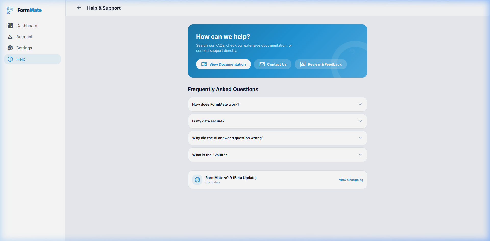

# Help Center Specification

## Overview
The Help screen (`/help`) resolves user FAQs, handles contact routing, and provides the product changelog. It is structured identically to the logged-in app layout despite being accessible globally.

## Screenshots

### Help Center View

---

## Layout Breakdown

### 1. Left Sidebar
- Standard application layout left-sidebar with `Dashboard`, `Account`, `Settings`, `Help` anchors.

### 2. Hero Component
- Highly styled gradient box `var(--fm-gradient-primary)`.
- Background features a massively upscaled icon watermark (`rotate-12`) and concentric border decorations for visual flair.
- Contains three CTA Ghost Buttons mapping to `docs`, `contact`, and `review`.

### 3. FAQ Section
- **Component reference**: Custom Accordion.
- Contains 4 hardcoded Q&A groupings. Clicking a header expands the inner `p` text via standard JS height calculation.

### 4. Version Info
- Fixed row indicating `FormMate v0.9 (Beta Update)`.
- Features an actionable "View Changelog" link forcing the `modal` component overlay.

---

## Modals

### Changelog Modal
- Rendered via standard `showModal('changelog-modal')` component.
- Visuals: Left-border timeline aesthetic using `border-l-2` mapped directly to `--fm-primary`.

---

## Interaction Mapping

| Element | Interaction | Result |
|---------|-------------|--------|
| View Docs Button | Click | Maps router location to `/docs` |
| Contact Button | Click | Maps router location to `/docs#contact` (Forces smooth scroll payload) |
| Accordion Title | Click | Swaps `aria-expanded` and unhides max-height text |
