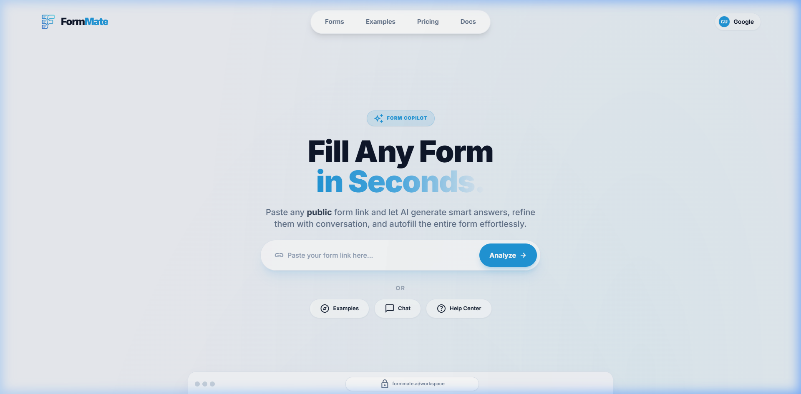
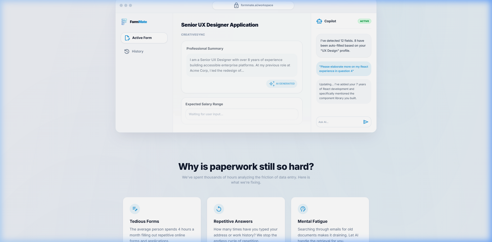
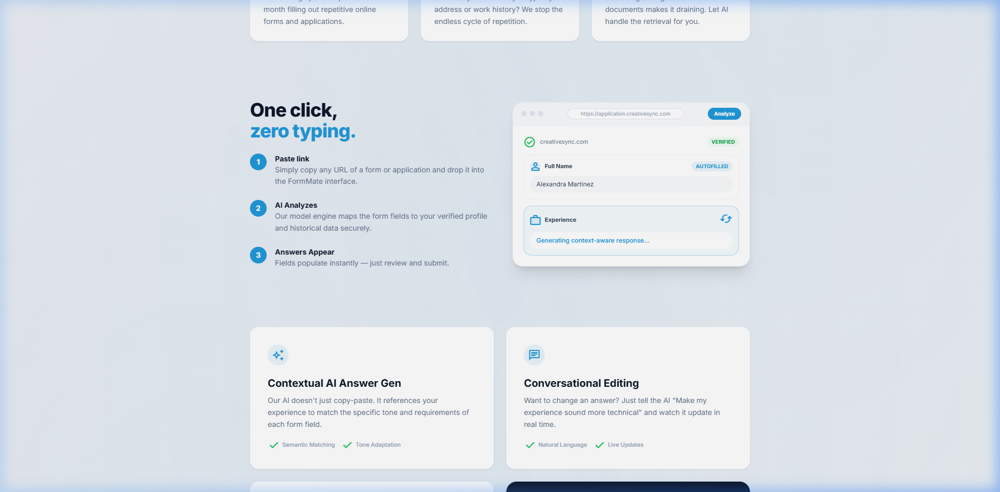
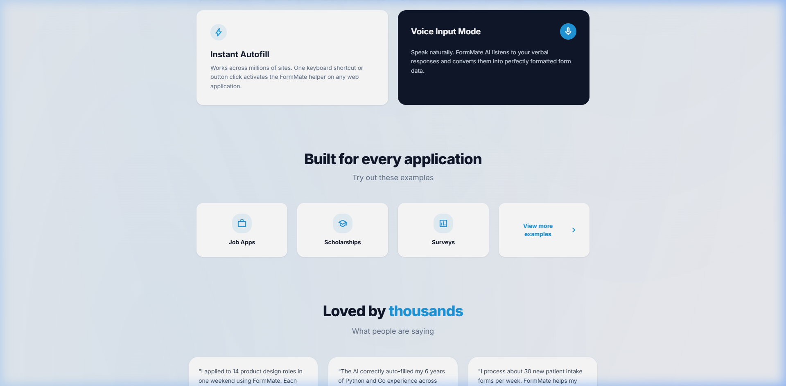
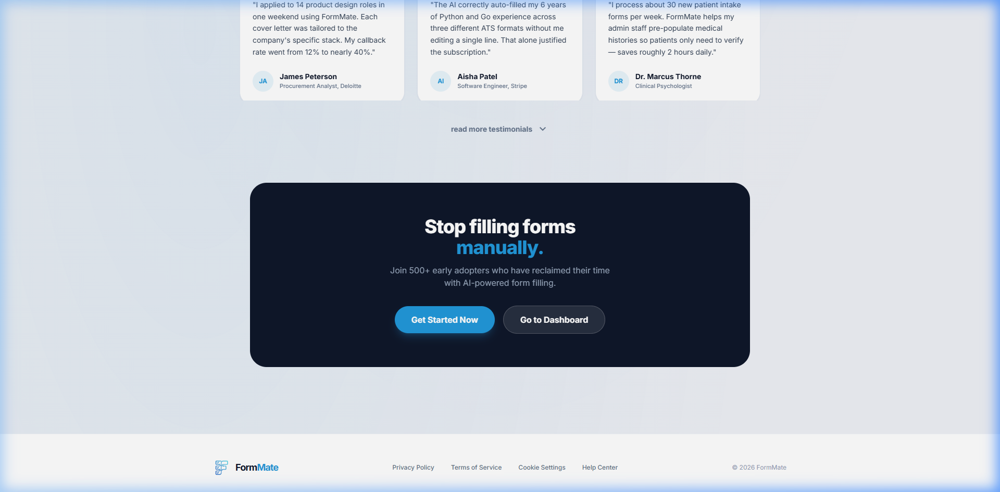
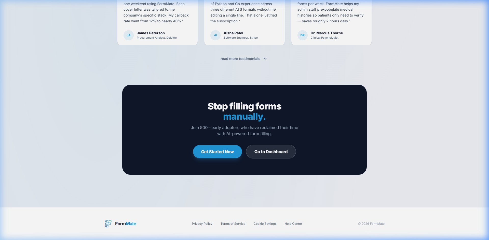
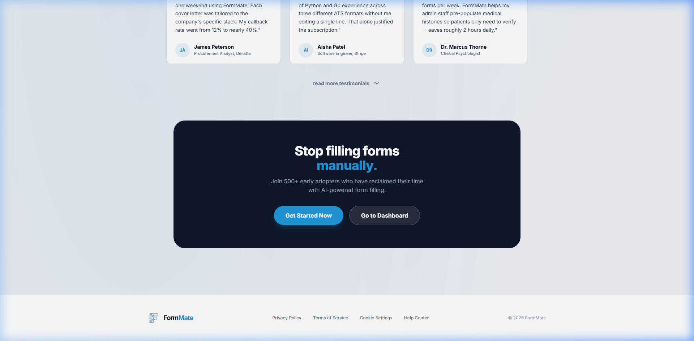
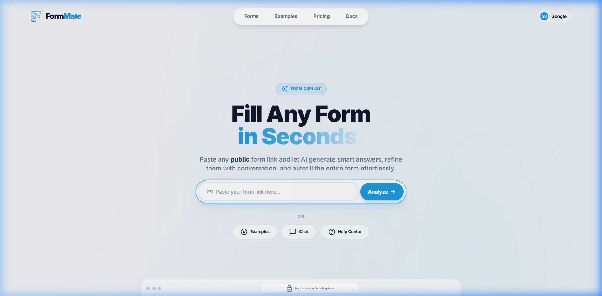
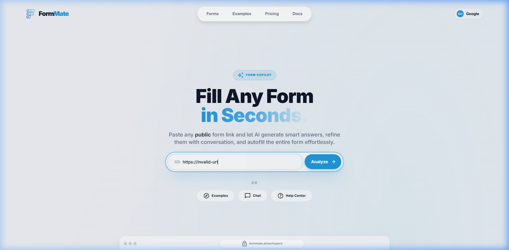

# Homepage / Landing Page — UI Specification

> **Route**: `/` · **Title**: `Home | FormMate` · **File**: `src/screens/landing.js`

---

## Overview

The homepage is the primary marketing and entry point for FormMate. It introduces the product, demonstrates its value through a workspace mockup, explains the problem it solves, lists features, showcases example use cases, displays testimonials, and includes a CTA banner. Unauthenticated users see "Sign In"; authenticated users see their avatar/name pill.

---

## Screenshots

### Above the Fold (Default)


### Full Scroll Sections
````carousel

<!-- slide -->

<!-- slide -->

<!-- slide -->

<!-- slide -->

<!-- slide -->

````

### Interaction States
````carousel

<!-- slide -->

<!-- slide -->

````

---

## Layout Breakdown (Top → Bottom)

### Section 1: Header / Navigation

- **Position**: Sticky top, `z-50`
- **Structure**: `<header>` → three-part flex layout (logo | nav | auth button)
- **Elements**:
  - **Logo** (left): `size-10` logo image + "Form**Mate**" text (`text-2xl font-black tracking-tighter`). "Mate" in `text-primary` (#2298da). Clickable → scrolls to top.
  - **Nav Pills** (center, hidden on mobile `hidden md:flex`):
    - Container: `bg-white/90 backdrop-blur-xl border border-slate-200/60 shadow-lg rounded-full px-2.5 py-2`
    - Items: "Forms", "Examples", "Pricing" (or "Subscription" for paid users), "Docs"
    - Font: `text-[15px] font-bold text-slate-500`
    - Hover: `hover:bg-slate-100 hover:text-slate-900 rounded-full px-6 py-2`
  - **Auth Button** (right):
    - Unauthenticated: Dark button "Sign In" (`bg-slate-900 text-white px-6 py-2.5 rounded-full`)
    - Authenticated: Profile pill (avatar + first name)
- **Spacing**: `px-6 py-6 md:px-12 lg:px-24`
- **Behavior**: `data-fm-hide-on-scroll="true"` — hides on scroll down, reappears on scroll up

---

### Section 2: Hero

- **Position**: Center of viewport, `pt-24 md:pt-40`
- **Structure**: Centered column, `max-w-[800px]`
- **Elements**:
  - **Badge Pill**: "✨ Form Copilot"
    - `bg-primary/10 text-primary text-[11px] font-black uppercase tracking-widest`
    - `rounded-full px-4 py-1.5 border border-primary/20 backdrop-blur-sm shadow-sm`
    - Hover: `hover:scale-105`
  - **Heading**: "Fill Any Form" + line break + "in Seconds."
    - `text-5xl md:text-7xl font-black leading-[1.05] tracking-tight text-slate-900`
    - "in Seconds." uses gradient text: `text-transparent bg-clip-text bg-gradient-to-r from-primary via-primary-light to-accent`
  - **Subheading**: "Paste any **public** form link and let AI generate smart answers..."
    - `text-slate-500 text-lg md:text-xl font-medium max-w-2xl mx-auto leading-relaxed mt-6`
    - "public" is bold: `font-bold text-slate-700`
  - **URL Input** (see Hero URL Input in reusable components)
    - Container: `mt-12 max-w-2xl mx-auto`
    - Input placeholder: "Paste your form link here..."
    - Button text: "Analyze" with right arrow SVG icon
  - **Alt Actions** (below input, `mt-8`):
    - "Or" divider: `text-slate-500 text-sm font-bold uppercase tracking-widest opacity-60`
    - Three pill buttons: "🔍 Examples", "💬 Chat", "❓ Help Center"
    - Each: `px-6 py-2.5 rounded-full bg-white/70 backdrop-blur-sm border border-slate-200 text-[13px] font-bold`
- **Animation**: `animate-screen-enter` on the hero div

---

### Section 3: Workspace Preview Mockup

- **Position**: Below hero, `mt-32`, `max-w-[1020px]`
- **Structure**: Browser-chrome mockup with three columns
- **Elements**:
  - **Chrome Bar**: Three gray dots + lock icon + "formmate.ai/workspace" URL bar
  - **Left Column** (sidebar preview, `w-56`, hidden on mobile):
    - Mini logo + "FormMate" text
    - "Active Form" item (highlighted with icon `edit_document`)
    - "History" item (muted)
  - **Center Column** (questions area):
    - Title: "Senior UX Designer Application" (`text-xl font-black`)
    - Subtitle: "CreativeSync" (`text-[11px] font-bold text-slate-400 uppercase`)
    - Question Card 1: "Professional Summary" — filled with sample AI text, "AI GENERATED" badge
    - Question Card 2: "Expected Salary Range" — dashed border, "Waiting for user input..." text, `opacity-70 cursor-not-allowed`
    - Bottom fade gradient overlay
  - **Right Column** (AI chat preview, `w-64`, hidden on tablet):
    - Header: Robot icon + "Copilot" label + "Active" green badge
    - AI message bubble: "I've detected 12 fields..."
    - User message bubble (primary bg): "Please elaborate more on my React experience..."
    - AI response: "Updating... I've added your 7 years of React development..."
    - Chat input mockup: "Ask AI..." placeholder
- **Hover effect**: `hover:shadow-[0_20px_60px_-15px_rgba(91,19,236,0.15)]`

---

### Section 4: "Why is paperwork still so hard?"

- **Position**: `mt-28`, `max-w-[960px]`, centered text
- **Heading**: "Why is paperwork still so hard?" — `text-3xl md:text-4xl font-extrabold tracking-tight`
- **Subheading**: "We've spent thousands of hours analyzing the friction of data entry. Here is what we're fixing."
- **Cards** (3-column grid): Each card has:
  - Icon circle: `size-10 rounded-full bg-primary/10 text-primary`
  - Title: `text-base font-bold text-slate-900`
  - Description: `text-slate-500 text-sm leading-relaxed`
  - Cards:
    1. "Tedious Forms" (icon: `edit_note`) — "The average person spends 4 hours a month filling out repetitive online forms and applications."
    2. "Repetitive Answers" (icon: `replay`) — "How many times have you typed your address or work history? We stop the endless cycle of repetition."
    3. "Mental Fatigue" (icon: `psychology_alt`) — "Searching through emails for old documents makes it draining. Let AI handle the retrieval for you."

---

### Section 5: "One click, zero typing."

- **Position**: `mt-28`, `max-w-[960px]`
- **Layout**: Two columns (`md:flex-row gap-12 items-center`)
- **Left Column** (Steps):
  - Heading: "One click," + br + "**zero typing.**" (primary colored)
  - Steps (numbered circles + text):
    1. "Paste link" — "Simply copy any URL of a form or application and drop it into the FormMate interface."
    2. "AI Analyzes" — "Our model engine maps the form fields to your verified profile and historical data securely."
    3. "Answers Appear" — "Fields populate instantly — just review and submit."
  - Number circles: `size-8 rounded-full bg-primary text-white text-sm font-bold`
- **Right Column** (Mini mockup):
  - Browser frame with URL "https://application.creativesync.com"
  - Verified domain badge ("creativesync.com" + "VERIFIED" green pill)
  - "Full Name" field: "Alexandra Martinez" with "AUTOFILLED" badge
  - "Experience" field: blue border, spinning sync icon, "Generating context-aware response..."

---

### Section 6: Feature Showpieces (2×2 grid)

- **Position**: `mt-28`, `max-w-[960px]`
- **Row 1** (2 cards):
  1. "Contextual AI Answer Gen" — ✨ icon, description, "✓ Semantic Matching", "✓ Tone Adaptation" pills
  2. "Conversational Editing" — 💬 icon, description, "✓ Natural Language", "✓ Live Updates" pills
- **Row 2** (2 cards):
  1. "Instant Autofill" — ⚡ icon, white card
  2. "Voice Input Mode" — 🎤 icon, **dark card** (`bg-slate-900 text-white`), mic button (`rounded-full bg-primary`)

---

### Section 7: "Built for every application"

- **Position**: `mt-28`, centered text
- **Grid** (4 columns `md:grid-cols-4`): Each card is a button with icon + label
  1. "Job Apps" (icon: `work`)
  2. "Scholarships" (icon: `school`)
  3. "Surveys" (icon: `poll`)
  4. "View more examples →" (chevron, primary text)
- **Behavior**: Click on demo card → sets demo URL + navigates to `analyzing` screen

---

### Section 8: Testimonials ("Loved by _thousands_")

- **Position**: `mt-28`, `max-w-[1000px]`
- **Initial state**: Grid collapsed to `max-height: 220px` with gradient overlay
- **Grid**: `grid-cols-1 md:grid-cols-2 lg:grid-cols-3 gap-6`
- **12 testimonial cards** (see Testimonial Card in reusable components)
- **"read more testimonials" button**: `text-sm font-bold text-slate-500 rounded-full` with `expand_more` icon
- **Expanded state**: Full height, button text changes to "Show less", icon changes to `expand_less`, gradient fades to `opacity-0`

---

### Section 9: CTA Banner

- **Position**: `mt-20 mb-16`, `max-w-[960px]`
- **Visual**: `bg-slate-900 rounded-3xl p-12 md:p-16 text-center`
- **Elements**:
  - Heading: "Stop filling forms" + br + "**manually.**" (primary colored) — `text-white text-3xl md:text-4xl font-extrabold`
  - Subtext: "Join 500+ early adopters who have reclaimed their time with AI-powered form filling." — `text-slate-400 text-base max-w-md mx-auto mb-8`
  - Buttons: "Get Started Now" (primary) + "Sign In" / "Go to Dashboard" (ghost white)

---

### Section 10: Footer

- **Position**: Bottom, `border-t border-slate-100 bg-white`
- **Layout**: `max-w-[1100px] mx-auto flex md:flex-row justify-between items-center`
- **Elements**:
  - Logo + "FormMate" (left)
  - Links (center): "Privacy Policy", "Terms of Service", "Cookie Settings", "Help Center" — `text-xs text-slate-500 font-medium`
  - Copyright (right): "© 2026 FormMate" — `text-xs text-slate-400`

---

## Interaction Mapping

| Trigger | Action |
|---------|--------|
| Click "Sign In" button | Navigate to `/auth` |
| Click nav "Forms" | Navigate to `/new` (auth) or `/auth` (unauth) |
| Click nav "Examples" | Navigate to `/examples` |
| Click nav "Pricing" | Navigate to `/pricing` |
| Click nav "Docs" | Navigate to `/docs` |
| Click profile pill | Navigate to `/accounts` |
| Click logo | Smooth scroll to top |
| Focus URL input | Ring glow appears on wrapper |
| Click "Analyze" (empty) | Error state: input shakes, button turns red with "⚠ Please enter a link" |
| Click "Analyze" (unsupported URL) | Error: "⚠ Unsupported form provider" |
| Click "Analyze" (valid URL) | Save URL to state → Navigate to `/analyzing` |
| Press Enter in URL input | Triggers Analyze click |
| Click demo card (Job Apps, etc.) | Set demo URL → Navigate to `/analyzing` |
| Click "View more examples" | Navigate to `/examples` |
| Hover any button | Scale/shadow/color transition |
| Click "read more testimonials" | Expand grid to full height, toggle button text |
| Click "Get Started Now" | Scroll to URL input + focus |
| Click "Go to Dashboard" / "Sign In" | Navigate to dashboard or auth |
| Click "Help Center" (footer) | Navigate to `/docs` |
