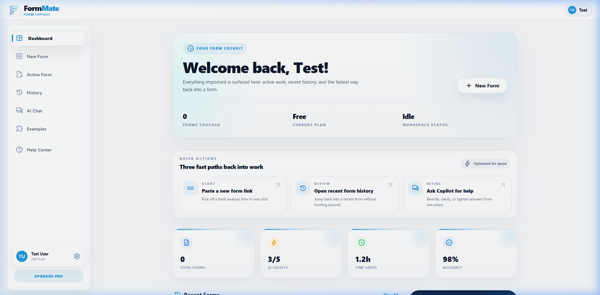
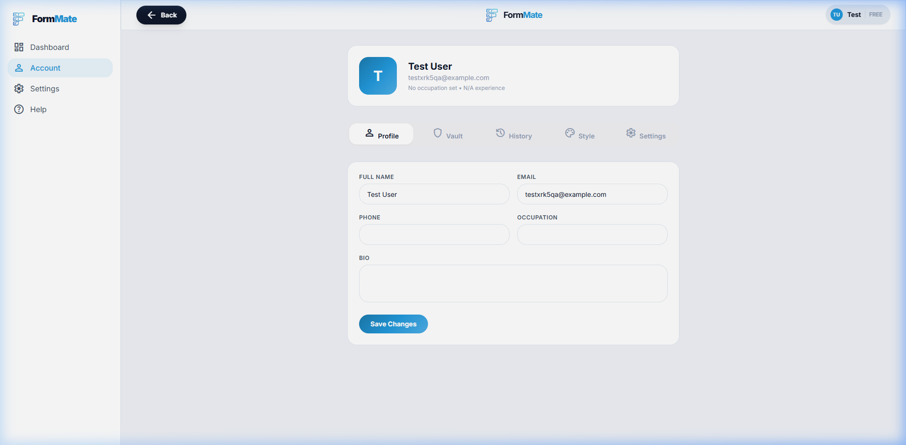
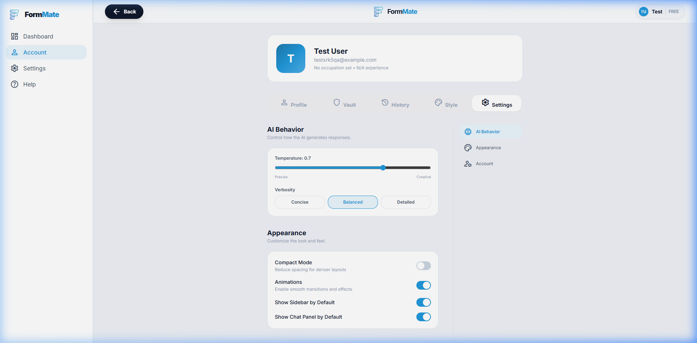
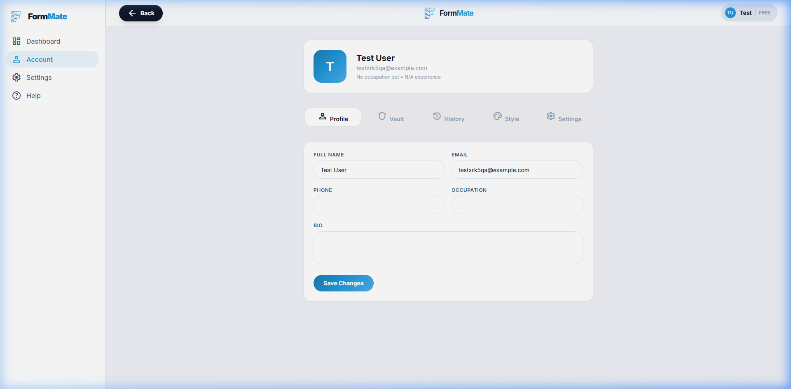
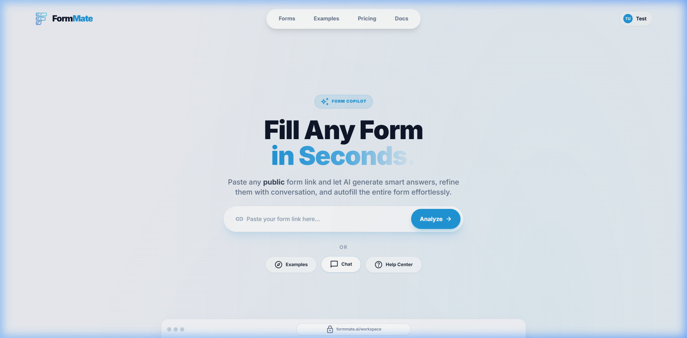

# Modal Interactions — UI Specification

> **File**: `src/components/command-palette.js`, `src/components/ui-components.js`

---

## Overview

FormMate uses modal overlays for secondary interactions. The primary modals documented here are the **Command Palette** (global keyboard shortcut) and the **Generic Modal** system used for confirmations and dialogs. The Accounts page provides **tab-based interaction** (Profile / Settings).

---

## Screenshots

### Command Palette (Opened)


### Accounts Page — Tab States
````carousel

<!-- slide -->

````

### Additional Modal States
````carousel

<!-- slide -->

````

---

## Modal 1: Command Palette

### Trigger
- Keyboard shortcut: `Ctrl+K` (Windows) / `Cmd+K` (Mac)
- Function: `window.openCommandPalette()`

### Structure
```
Fixed overlay (full viewport, z-100)
├── Backdrop: bg-slate-900/40 + backdrop-blur-sm
└── Content panel (centered at 15vh from top)
    ├── Search bar (h-14)
    │   ├── Search icon (material: "search", text-slate-400)
    │   ├── Input (text-lg font-medium, placeholder: "Type a command or search...")
    │   └── ESC badge (kbd element, hidden on mobile)
    └── Results list (scrollable, max-h-[60vh])
        └── Command items (buttons, stacked)
```

### Element Details

| Element | Exact Text / Content | Size | Visual |
|---------|---------------------|------|--------|
| Panel | — | `max-w-xl` | `bg-white/95 backdrop-blur-xl rounded-2xl shadow-2xl border border-slate-200` |
| Search input | placeholder: "Type a command or search..." | `h-14` | `text-lg font-medium`, no border, transparent bg |
| ESC badge | "ESC" | `text-[10px]` | `font-mono text-slate-400 bg-slate-100 rounded border border-slate-200 px-2 py-1 uppercase` |
| Command — Create New Form | title: "Create New Form", desc: "Start a new form via URL" | `p-3` | Icon: `add_box`, route: `/new` |
| Command — Active Form | title: "Active Form", desc: "Return to your current workspace" | `p-3` | Icon: `edit_document`, route: `/workspace`, auth required |
| Command — Form History | title: "Form History", desc: "View past completed forms" | `p-3` | Icon: `history`, route: `/accounts`, auth required |
| Command — My Vault | title: "My Vault", desc: "Manage your saved personal information" | `p-3` | Icon: `lock`, route: `/accounts`, auth required |
| Command — Settings | title: "Settings", desc: "App preferences and configurations" | `p-3` | Icon: `settings`, route: `/settings` → `/accounts`, auth required |
| Command — Help & Support | title: "Help & Support", desc: "Get assistance and view FAQs" | `p-3` | Icon: `help`, route: `/help` |

### Result Item Style
- Layout: `flex items-center gap-3 p-3 rounded-xl`
- Icon container: `size-10 rounded-lg bg-white shadow-sm border border-slate-100`
- Title: `text-sm font-bold text-slate-900`
- Description: `text-[11px] font-medium text-slate-500`
- Chevron: `material-symbols-outlined text-slate-300`
- First result: `bg-slate-50 border border-slate-200/50` (pre-selected appearance)
- Hover: `hover:bg-slate-100`, icon container becomes `bg-primary text-white border-primary`
- No results: "🔍 No commands found for '[query]'" — `py-8 text-center text-slate-500`

### Behavior

| Trigger | Action |
|---------|--------|
| `Ctrl+K` / `Cmd+K` | Toggle open/close |
| `Escape` | Close palette |
| Click overlay backdrop | Close palette |
| Type in search | Filter commands by title/description match |
| Click command item | Navigate to route (if auth passes), close palette |
| Click auth-required item (unauthenticated) | Toast error "Please sign in" → navigate to `/auth` |

---

## Modal 2: Generic Modal System

### Structure (via `renderModal()`)
```
Fixed overlay (z-[var(--fm-z-modal,50)])
├── Backdrop: bg-black/40 + backdrop-blur-sm (data-modal-overlay)
└── Centered panel (-translate-x/y 1/2)
    ├── Header (optional): title (text-xl font-bold) + close button
    └── Content area (px-6 pb-6, max-h-[70vh], overflow-y-auto)
```

### Size Variants

| Size | Max Width |
|------|-----------|
| `sm` | `max-w-sm` (384px) |
| `md` | `max-w-md` (448px) |
| `lg` | `max-w-lg` (512px) |
| `xl` | `max-w-xl` (576px) |
| `full` | `max-w-3xl` (768px) |

### Visual Traits
- Panel background: `var(--fm-bg-elevated)` (#ffffff)
- Border-radius: `rounded-2xl`
- Shadow: `var(--fm-shadow-xl)` → `0 20px 25px -5px rgba(0,0,0,0.08), 0 8px 10px -6px rgba(0,0,0,0.04)`
- Enter animation: `screenFadeIn 0.25s ease-out`
- Exit animation: `screenFadeOut 0.15s ease-out`, hidden after 150ms

### Close Button
- `data-modal-close` attribute
- Visual: `p-2 hover:bg-slate-100 rounded-lg`, icon: `close` (Material Symbols)
- Color: `var(--fm-text-secondary)`

---

## Tab Interaction: Accounts Page

### Tab Bar

- **Position**: Top of content area, below heading
- **Container**: `flex gap-1 p-1 rounded-xl`, bg: `var(--fm-bg-sunken)` (#f0f0f3)

### Tab 1: Profile (Default Active)

| Element | Content |
|---------|---------|
| Tab label | "Profile" |
| Active style | `bg-white shadow-sm`, text: `var(--fm-text)` (dark) |
| Content | User avatar, name, email, bio editor, tier badge, profile fields |

### Tab 2: Settings

| Element | Content |
|---------|---------|
| Tab label | "Settings" |
| Inactive style | No bg, text: `var(--fm-text-tertiary)`, `hover:bg-white/50` |
| Content | Toggle switches for animations, notifications, AI preferences; Sign out button; Danger zone (delete account) |

### Tab Switching Behavior
- Click inactive tab → becomes active (white bg + shadow), previous tab becomes inactive
- `onChange` callback fires with the new tab index
- Content panel swaps instantly (no animation between tab content)

---

## Interaction Mapping Summary

| Trigger | Action |
|---------|--------|
| `Ctrl+K` / `Cmd+K` | Open/close command palette |
| ESC key | Close any open modal or command palette |
| Click modal overlay | Close modal |
| Click × close button | Close modal |
| Click tab button | Switch active tab, update content |
| Modal open | Fade-in animation (0.25s) |
| Modal close | Fade-out animation (0.15s) → hide |
