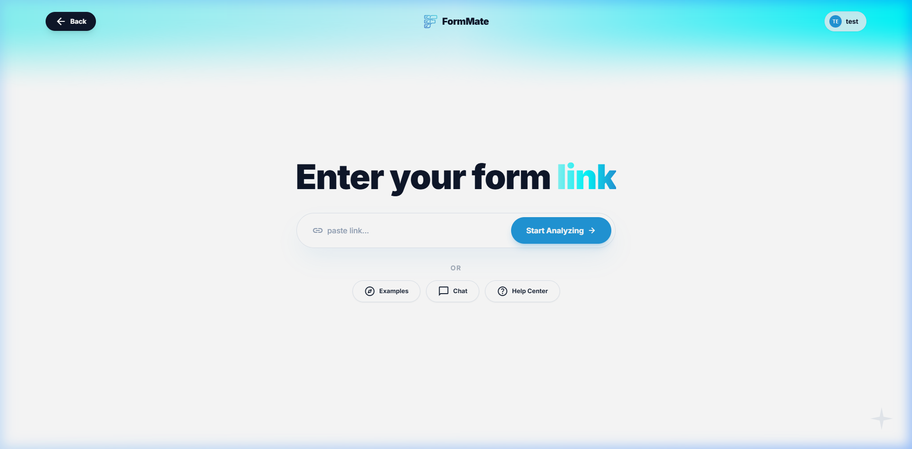

# New Form Specification

## Overview
The New Form screen (`/new`) sits at the very core of the FormMate flow. It focuses entirely on a single input parameter: the target URL. 

## Screenshots

### Default State

---

## Layout Breakdown

### 1. Aurora Background (`Aurora.js`)
- **Structure**: WebGL/Canvas-based dynamic background component (`#aurora-bg`).
- **Visuals**: Slow-moving organic gradients applying the branded `mesh` colors.

### 2. Header
- **Navigation**: "Back" button (left), Logo/Home (center), Profile/SignIn (right).
- **Behavior**: `sticky top-0 z-50 transition-all`.

### 3. Center Unit
- **Headline**: "Enter your form `link`" (The word "link" has a `text-link-gradient` with `animate-gradient-x`).
- **Input Pill**:
  - Extremely large (`max-w-2xl`).
  - `bg-white/80 backdrop-blur-md` with intense shadowing `shadow-2xl`.
  - Left-aligned Material icon (`link`).
- **Action Button**: "Start Analyzing" (`bg-primary`, rounding, floating effect). Arrow icon shifts right on `group-hover`.

### 4. Alternative Nav
- **Label**: "Or" with tracking-widest text.
- **Action Pills**: `Examples`, `Chat`, `Help Center`.
- **Styling**: `bg-white/70`, `backdrop-blur-sm`, high rounding.

---

## Interaction Mapping

| Element | Interaction | Result |
|---------|-------------|--------|
| URL Input | Focus | Triggers a thick focus ring `focus-within:ring-primary/20` around the entire pill |
| URL Input | Keydown (Enter) | If valid URL, triggers analysis payload |
| `Start Analyzing` | Click | Triggers pipeline loading component, transitions router to `/analyzing` |
| Examples Nav | Click | Directs to `/examples` |
