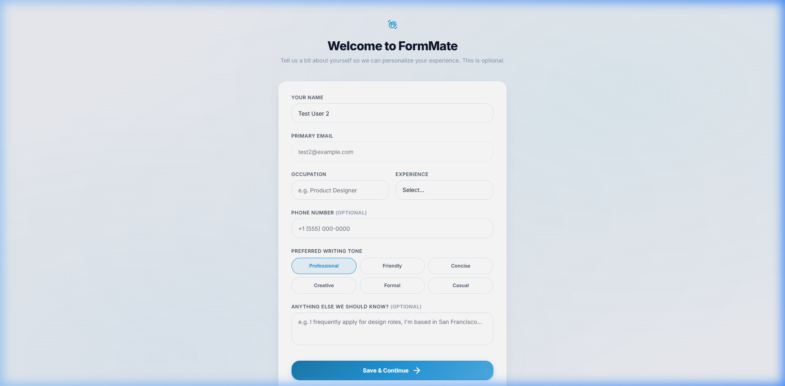

# Onboarding Specification

## Overview
The Onboarding flow (`/onboarding`) acts as a bridge between signup and dashboard access. It populates the core `Vault` variables that the AI requires to answer forms natively (Bio, Context, Occupation).

## Screenshots

### Welcome Step 1

---

## Layout Breakdown

### 1. Full-Screen Takeover
- Removes standard navigation elements (`back`, `home` anchors hidden).
- Enforces an `overflow-hidden` container preventing scroll-out.

### 2. Progress Tracker
- Top-anchored dot progress indicator. Active states map to `#2298da`.

### 3. Step Pages
- Uses simple JS class toggling to cycle `hidden`/`block` active screens.
- **Screen 1**: "Who are you?" Requires `First Name` and `Last Name`.
- **Screen 2**: "What do you do?" Requires `Occupation`. Includes optional "Bio" textarea block.
- **Screen 3**: "How should the AI sound?" Actionable selection grid for user preferences (`Professional`, `Concise`, `Creative`).

### 4. Sticky Footer
- Pinned bottom UI bar mapping `Back` and `Save & Continue` logic, preventing skipping.

---

## Interaction Mapping

| Element | Interaction | Result |
|---------|-------------|--------|
| Next/Continue Button | Click | Validates current form fields. If passing, increments active step and updates the state. |
| Final Step Button | Click | Commits payload to `localStorage(vault)` and fires `navigateTo('dashboard')`. |
| Skip Action | Click | Available conditionally to bypass deep bio writing. |
