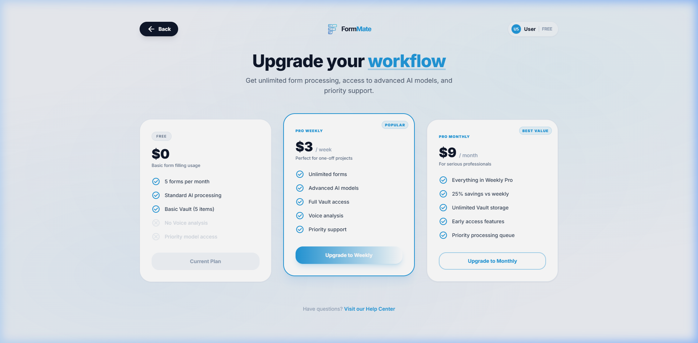

# Pricing Specification

## Overview
The Pricing screen (`/pricing`) is accessible to both unauthenticated marketing traffic and authenticated users seeking to upgrade their usage limits.

## Screenshots

### Default View

---

## Layout Breakdown

### 1. Top Section
- **Header**: Standard transparent/glass navigation shared with `layout.js` instances.
- **Hero**: "Simple, transparent pricing" over a subtle gradient mesh background.

### 2. Pricing Grid
- **Container**: `grid grid-cols-1 md:grid-cols-3` displaying three highly structured tier cards.
- **Tiers**:
  - `Starter` (Free)
  - `Pro Weekly` (Most Popular)
  - `Pro Monthly` (Best Value)
- **Visual Callouts**: 
  - "Most Popular" ribbon uses `bg-primary text-white text-[10px]`.
  - Monthly card features a distinct internal gradient (`bg-slate-900 text-white`) to draw visual hierarchy.
  - Buttons scale down on hover for standard tiers, but the Monthly tier button scales up `hover:scale-105 active:scale-95`.

### 3. Modal Sub-Components
- **Cancellation Modal**: Intercepts users attempting to drop from Pro to Free. Asks for feedback (Too expensive, Not useful, Buggy) via a `radio` group before firing the downgrade state loop.

---

## Interaction Mapping

| Element | Interaction | Result |
|---------|-------------|--------|
| Tier CTA Button | Click | If Auth: Checks `tier` in state. If upgrading, opens Stripe logic. If downgrading, opens Cancellation modal. If un-Auth: Routes to `/auth` |
| Feature Row Check | Hover | The row text turns from `slate-500` to `slate-900` |
