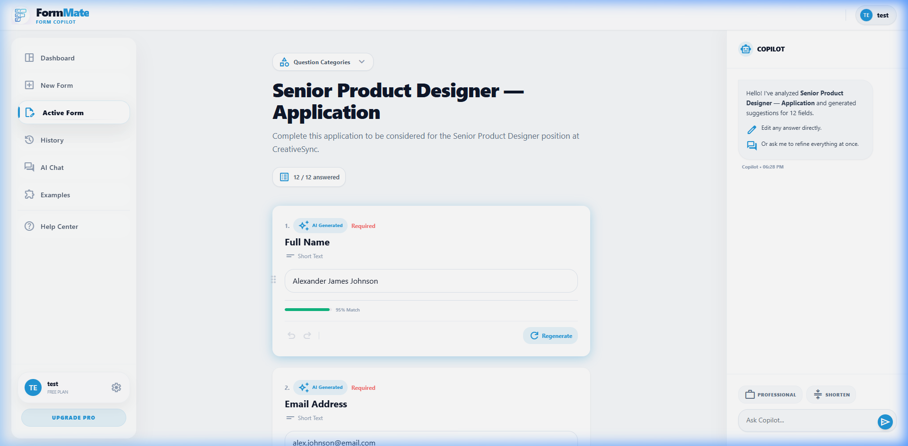

# Workspace Specification

## Overview
The Workspace (`/workspace`) is the primary editing interface where auto-generated form data is reviewed, tweaked, and ultimately submitted. It uniquely integrates a split-pane layout with a conversational Copilot.

## Screenshots

### Workspace Editor & Copilot

---

## Layout Breakdown

### 1. Split-Pane Architecture
- **Left Panel (Main Editor)**: `flex-1 overflow-y-auto`. Holds the form title, question cards, and summary stats.
- **Right Panel (Copilot)**: `w-80 lg:w-96 border-l border-slate-100 bg-white shadow-[-10px_0_30px_rgba(0,0,0,0.03)]`. Fixed chat interface.

### 2. Header & Metrics
- **Title**: Dynamic. Rendered from the scraped page title or `<h1/>`.
- **Metrics Bar**: `x / y answered` pill block indicating completion percentage.
- **Filters Dropdown**: Contains `Filter Pills` allowing users to filter the question list by Autofillable vs AI Generated vs Manual.

### 3. Question Stream (`#questions-container`)
- Stacked `Question Cards` (see `reusable_components.md`).
- Each card holds the question text, the drafted answer, and the methodology badge.
- Floating quick actions (Shorten, Professional) only appear on AI Generated cards.

### 4. Copilot Panel
- **Header**: Avatar + Title ("Copilot") + Dropdown to switch tone (e.g., Professional, Creative).
- **Chat Stream**: `overflow-y-auto` bubble list. User bubbles (Blue, right), Assistant bubbles (Gray, left).
- **Input Box**: Attached to bottom, auto-expanding textarea, floating action button (`send`).

---

## Interaction Mapping

| Element | Interaction | Result |
|---------|-------------|--------|
| Category Filter Pill | Click | Toggles visibility of Question Cards in the main stream based on match |
| Q-Card Textarea | Edit (Typing) | Marks question badge as "User Edited", locks field from global AI regenerations |
| Quick Action (Shorten) | Click | Instantly pings AI with context of that specific card, updating the textarea upon completion |
| Copilot Send | Click / Enter | Adds user bubble, triggers AI typing indicator, performs actions on the DOM based on intent |
| `Review & Submit` (Bottom) | Click | (Placeholder) Finalizes the dataset for form exportation |
